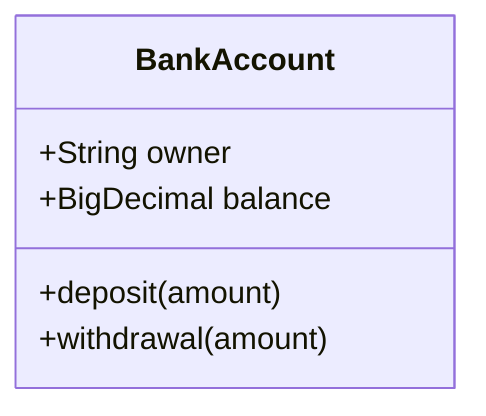
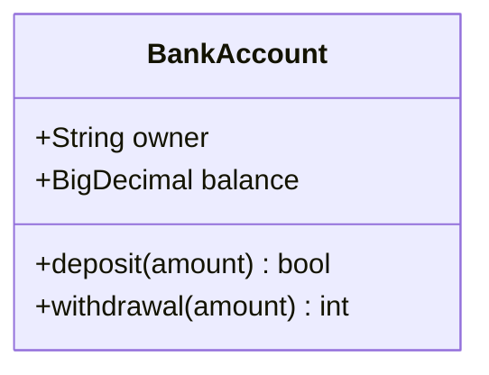
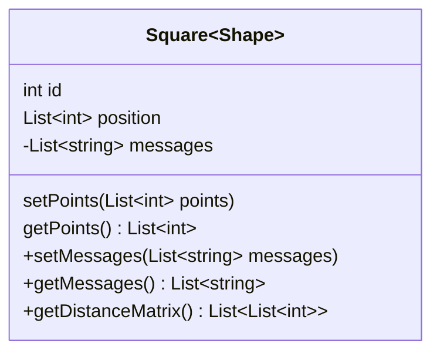
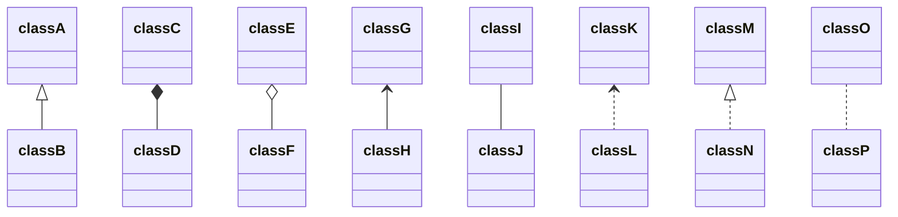
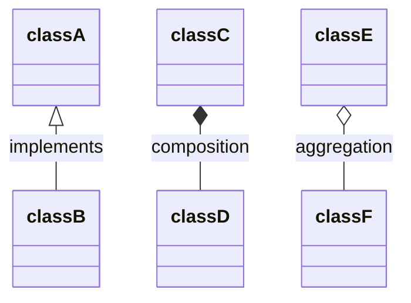
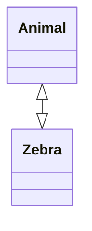
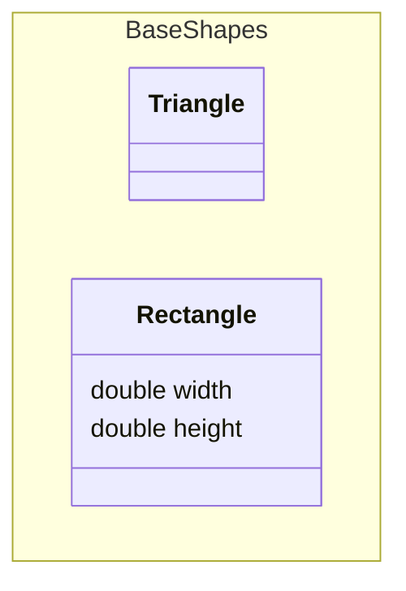
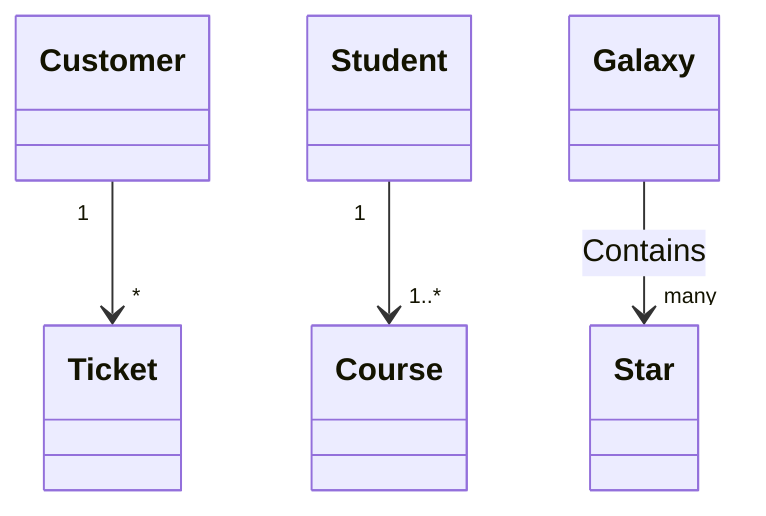

# UML-Klassendiagramme

In Dbs1 nutzen wir UML-Klassendiagramme *ausschliesslich* für das konzeptionelle Modell
(=Modellierung der Domäne)

## Darstellung einer Klasse in UML

Ein Klasse kann Attribute und Methoden beinhalten.



### Return Type
Für Methoden kann auch ein Rückgabetypen definiert werden



### Generische Typen

Generika können als Teil einer Klassendefinition und für Klassenmitglieder / Rückgabetypen dargestellt werden.



### Sichtbarkeit

Um die Sichtbarkeit (oder Kapselung) eines Attributs oder einer Methode/Funktion zu beschreiben, kann eine optionale Notation vor dem Namen des Mitglieds platziert werden:

- `+` Öffentlich
- `-` Privat
- `#` Geschützt
- `~` Paket/Intern

Zusätzlich können Klassifizierer zu einer Methodendefinition hinzugefügt werden, indem folgende Notationen am Ende der Methode hinzugefügt werden:

- `*` Abstrakt
- `$` Statisch


## Beziehungen definieren

Eine Beziehung ist ein allgemeiner Begriff, der spezifische logische Verbindungen zwischen Klassen und Objekten beschreibt.

```
[classA][Arrow][ClassB]
```

Es gibt acht verschiedene Beziehungstypen für Klassen in UML.

- `<|--` Inheritance
- `*--` Composition
- `o--` Aggregation
- `-->` Association
- `--` Link (Solid)
- `..>`	Dependency
- `..|>`  Realization
- `..` Link (Dashed)



### Label

Beziehungsbeschriftungen können hinzugefügt werden
```
[classA][Arrow][ClassB]:Label
```
Hier als Beispiel


### Zwei-Weg Beziehung

Beziehungen können logisch eine N:M darstellen:


## Namespace definieren

Ein Namespace gruppiert Klassen:



## Kardinalität / Multiplikation bei Beziehungen
Kardinalität oder Multiplikation in Klassendiagrammen zeigt die Anzahl der Instanzen einer Klasse, die mit einer Instanz der anderen Klasse verknüpft werden können.

Kardinalitätsnotationen werden am Ende einer Assoziation platziert.

```
[classA] "cardinality1" [Arrow] "cardinality2" [ClassB]:LabelText
```

Die verschiedenen Kardinalitätsoptionen sind:

- `1` Nur 1
- `0..1` Null oder Eins
- `1..*` Eins oder mehr
- `*` Viele
- `n` n (wobei n>1)
- `0..n` Null bis n (wobei n>1)
- `1..n` Eins bis n (wobei n>1)




## Diagramme

https://mermaid.js.org/syntax/classDiagram.html#class

