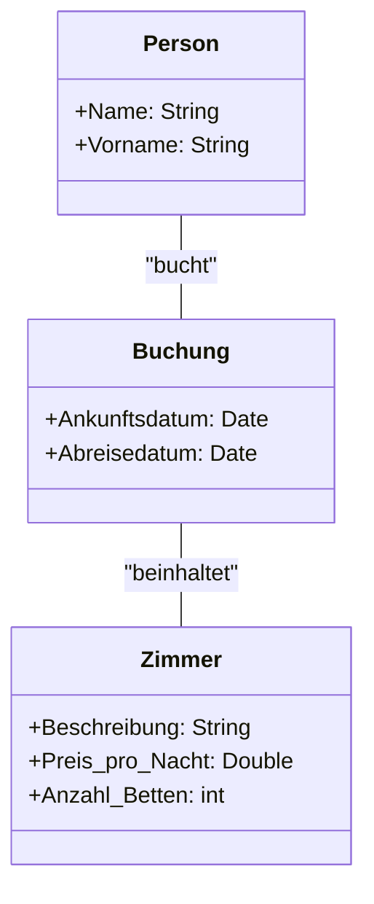
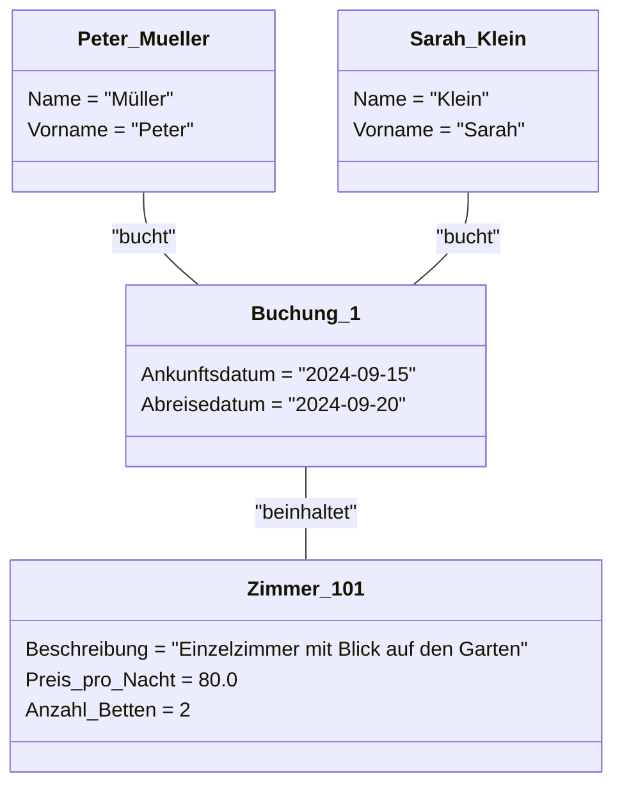

> An diesem Beispiel kann geübt werden, UML-Diagramme zu zeichnen. Das Resultat dieser Übung ist ein UML-Klassendiagramm.

# UML-Diagramm erstellen

## Klassen

- Person
  - Name (Attribut)
  - Vorname (Attribut)
- Zimmer
  - Beschreibung (Attribut)
  - Preis pro Nacht (Attribut)
  - Anzahl Betten (Attribut)
- Buchung
  - Gäste: Eine oder mehrere Personen (Assoziation)
  - Zimmer (Assoziation)
  - Ankunftsdatum (Attribut)
  - Abreisedatum (Attribut)

## Aufgaben:

1. Zeichnen Sie diese drei Klassen mit den richtigen Assoziationen als UML-Klassen-Diagramm, noch ohne Multiplizitäten-Angabe

2. Zeichnen Sie für verschiedene Beispielszenarien von Hotelbuchungen UML-Objekt-Diagramme oder Punkte-Ellipsen-Diagramme und analysieren Sie mit deren Hilfe die Multiplizitäten

3. Ergänzen Sie das UML-Klassendiagramm um die Multiplititäts-Angaben

