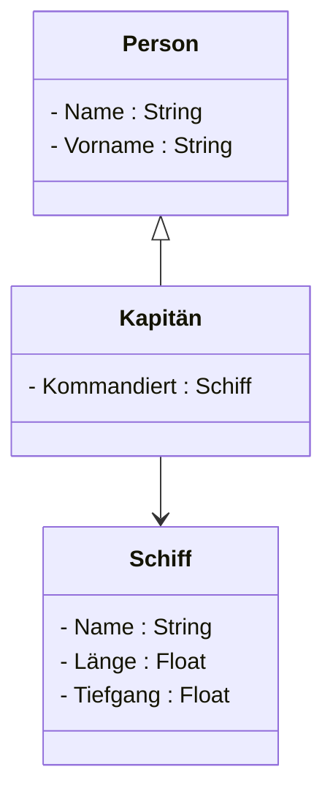
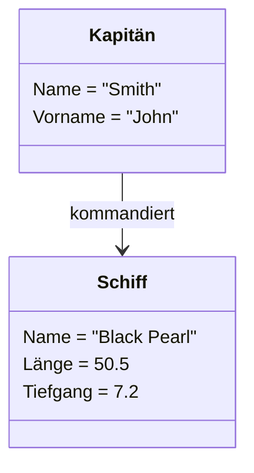
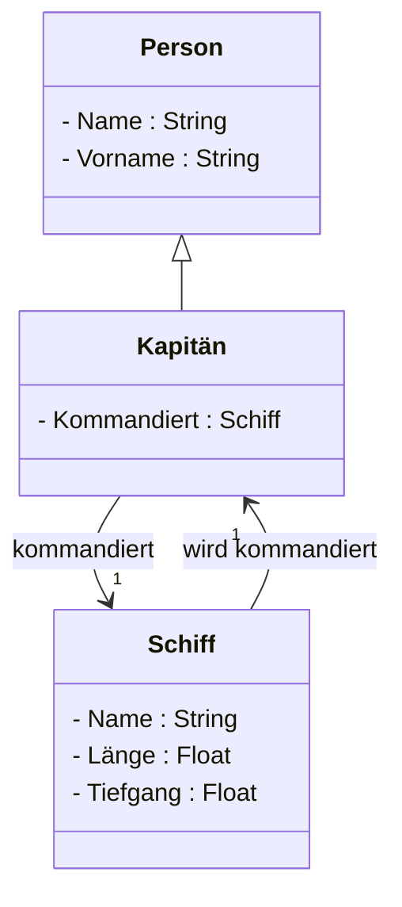
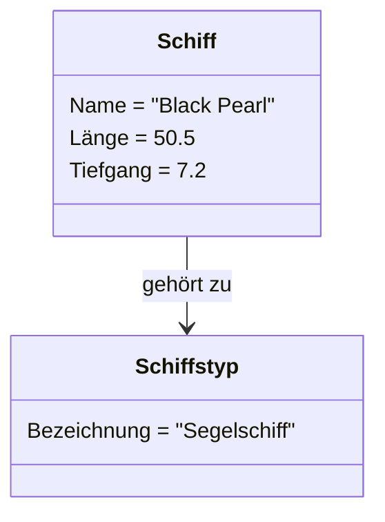
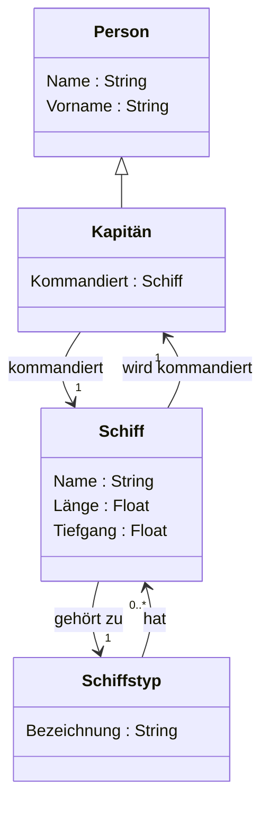
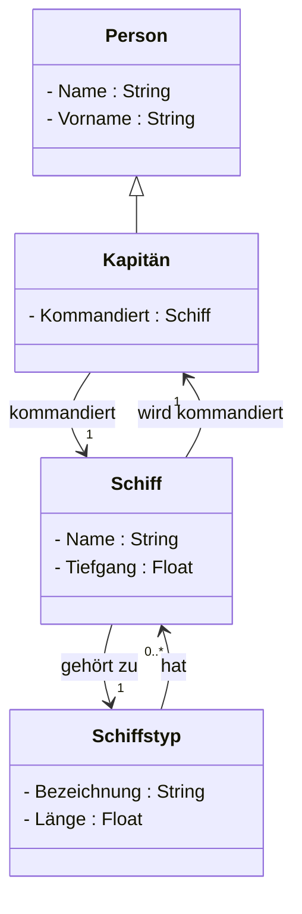

> An diesem Beispiel kann geübt werden, UML-Diagramme zu zeichnen. Das Resultat dieser Übung ist ein UML-Klassendiagramm.

# UML-Diagramm erstellen

## Klassen:

- Person
  - Name (Attribut)
  - Vorname (Attribut)
- Kapitän (ist Person)
  - Kommandiert genau ein Schiff (Assoziation)
- Schiff
  - (Wird genau von einem Kapitän kommandiert)
  - Name (Attribut)
  - Länge (Attribut)
  - Tiefgang (Attribut)

## Aufgaben:

1. Zeichnen Sie diese drei Klassen mit den richtigen Assoziationen als UML-Klassen-Diagramm, noch ohne Multiplizitäten-Angabe

2. Zeichnen Sie für verschiedene Beispielszenarien UML-Objekt-Diagramme oder Punkte-Ellipsen-Diagramme und analysieren Sie mit deren Hilfe die Multiplizitäten

3. Ergänzen Sie das UML-Klassendiagramm um die Multiplititäts-Angaben

# UML-Diagramm ausbauen

Es sollen verschiedene Typen von Schiffen unterschieden werden:

- Jedes Schiff hat genau einen Schiffstyp.
- Ein Schiffstyp hat eine Bezeichnung
- Von jedem Schiffstyp kann es beliebig viele (also möglicherweise auch keine) Schiffe geben.
- Wir wissen noch nicht, wie viele oder welche Schiffstypen es geben wird, können die Typen also nicht als Spezialisierung/Vererbung modellieren. Stattdessen sehen wir den Schiffstyp als eigene Klasse an.

## Aufgaben:

1. Zeichnen für verschiedene Beispielszenarien Punkte-Ellipsen-Diagramme (nur für Schiff und Schiffstyp) und analysieren Sie mit deren Hilfe die Multiplizitäten für die Beziehung zwischen diesen beiden Klassen

2. Ergänzen sie das UML-Klassendiagramm um die Klasse Schiffstyp (samt allfälligen Attributen) und diese Beziehung

# UML-Diagramm ändern

Die Kapitäne stellen fest, dass alle Schiffe des selben Typs immer dieselbe Länge haben und legen fest, dass dies auch für alle künftigen Schiffstypen so sein soll. Der Tiefgang kann für Schiffe des selben Typs jedoch unterschiedlich sein, da er vom individuellen Innenausbau und der Ladung abhängt.

## Aufgabe:

1. Ändern Sie das UML-Klassendiagramm entsprechen ab oder zeichnen Sie es mit dieser Änderung neu

