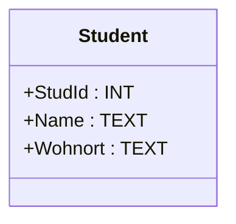
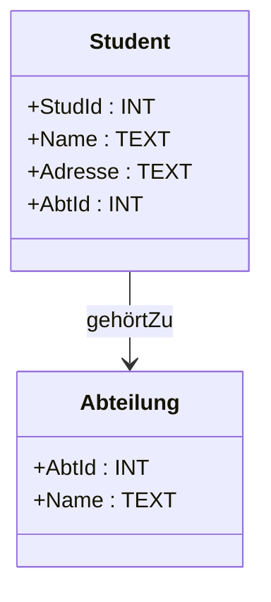
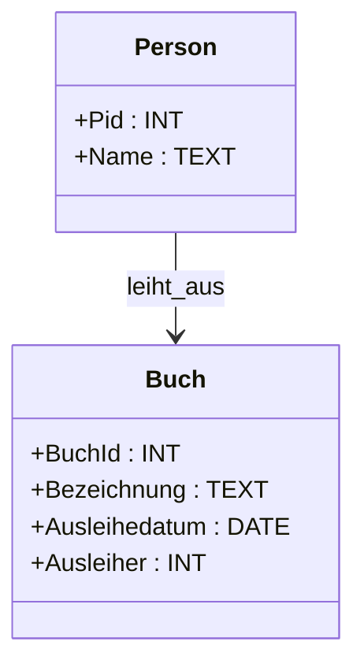
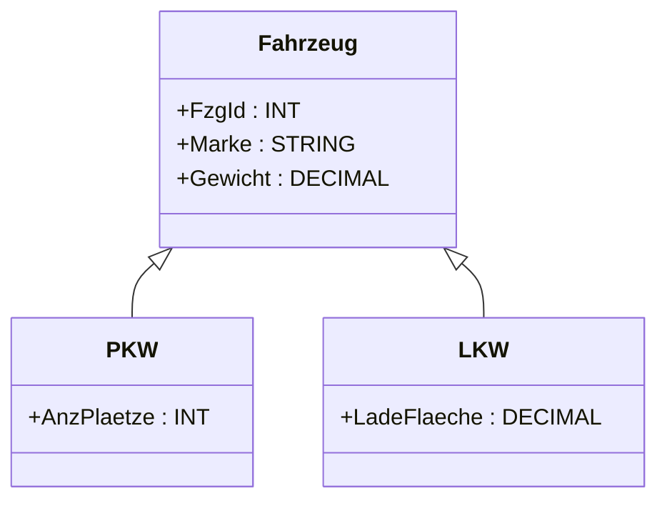
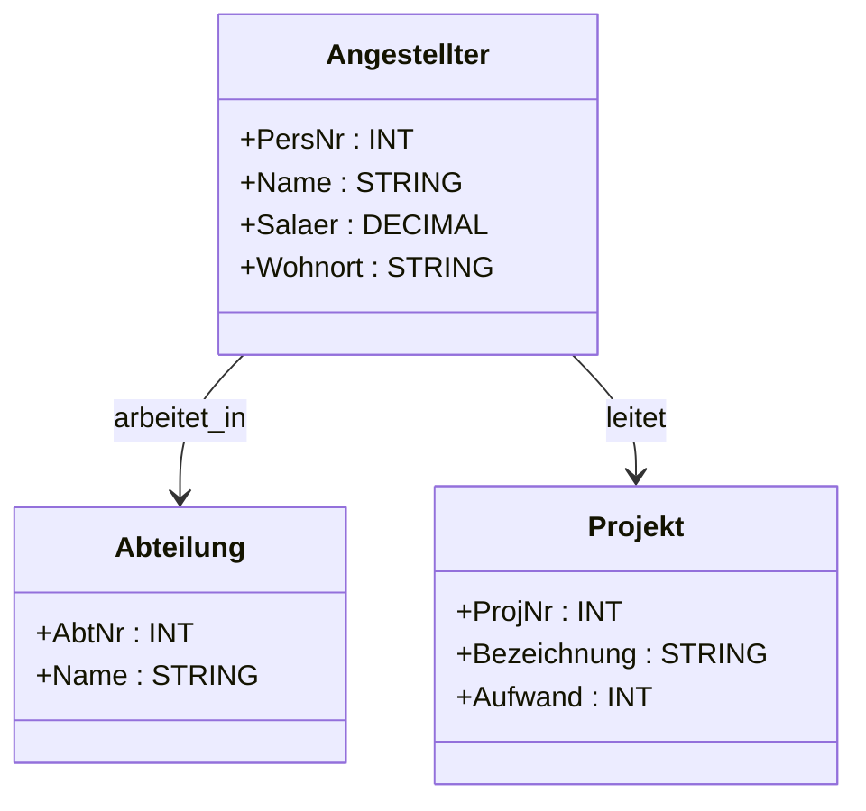

# Datenbanksysteme 1

## Ziel und Inhalt

Diese Vorlesung behandelt die Abbildung von UML-Klassendiagrammen in ein relationales Modell (relationale Schreibweise). Folgende Lernziele wurden vermittelt:

- Kenntnis der Abbildungsregeln
- Anwendung der relationalen Schreibweise

### Ablauf des Datenbank-Entwurfsprozesses

Der Datenbankentwurfsprozess umfasst drei Schritte:

1. **Konzeptueller Entwurf** (Anforderungsspezifikation)
2. **Logischer Entwurf** (DB-Schema)
3. **Physischer Entwurf**

## Abbildungsregeln

### Regel 1: Abbildung von Klassen

Jede Klasse wird auf eine Tabelle abgebildet. Attribute müssen unstrukturierte Werte besitzen und mindestens ein Attribut als Primärschlüssel ausgewiesen werden. Optionale Attribute können mit `NULL` modelliert werden.



Beispielrelation:

```
Student(StudId INT, Name TEXT NOT NULL, Wohnort TEXT)
```

### Regel 2: Abbildung von Assoziationen

#### One-to-Many Assoziation

Der Primärschlüssel der 1-Seite muss als Fremdschlüssel auf der \*-Seite erscheinen.



Beispielrelation:

```
Abteilung(AbtId INT, Name TEXT)
Student(StudId INT, Name TEXT, Adresse TEXT, AbtId INT REFERENCES Abteilung)
```

#### Optional One-to-One Assoziation

Beispiel für eine optionale Beziehung wie eine Ausleihe:



Beispielrelation:

```
Buch(BuchId INT, Bezeichnung TEXT, Ausleihedatum DATE, Ausleiher INT REFERENCES Person)
```

### Regel 3: Abbildung von Vererbung

#### 1:1-Abbildung (Vererbung)

Superklassen und Subklassen werden in separate Tabellen aufgeteilt, der Primärschlüssel der Subklasse ist Fremdschlüssel in der Superklasse.



Beispielrelationen:

```
Fahrzeug(FzgId INT, Marke STRING, Gewicht DECIMAL, FzgTyp INT)
PKW(FzgId INT REFERENCES Fahrzeug, AnzPlaetze INT)
LKW(FzgId INT REFERENCES Fahrzeug, LadeFlaeche DECIMAL)
```

## Zusammenhängendes Beispiel: Angestellter-Abteilung-Projekt

In diesem Beispiel wird gezeigt, wie Klassen und Assoziationen eines UML-Diagramms auf Tabellen abgebildet werden.



Beispielrelationen:

```
Angestellter(PersNr INT, Name STRING, Salaer DECIMAL, Wohnort STRING, AbtNr INT REFERENCES Abteilung)
Abteilung(AbtNr INT, Name STRING)
Projekt(ProjNr INT, Bezeichnung STRING, ProjLeiter INT REFERENCES Angestellter)
```

### Optionales Beispiel für Assoziationen mit Kardinalitäten

Assoziation mit 1..1 oder 0..1 Kardinalität kann über optionale Fremdschlüssel oder separate Beziehungstabellen abgebildet werden.

```
AbtLeitung(AbtNr INT REFERENCES Abteilung, AbtChefNr INT REFERENCES Angestellter)
```

## Fazit

Durch Anwendung der verschiedenen Abbildungsregeln können UML-Klassendiagramme systematisch in relationale Tabellenmodelle überführt werden. Dies umfasst die Abbildung von Klassen, Assoziationen, Aggregationen und Vererbung.
