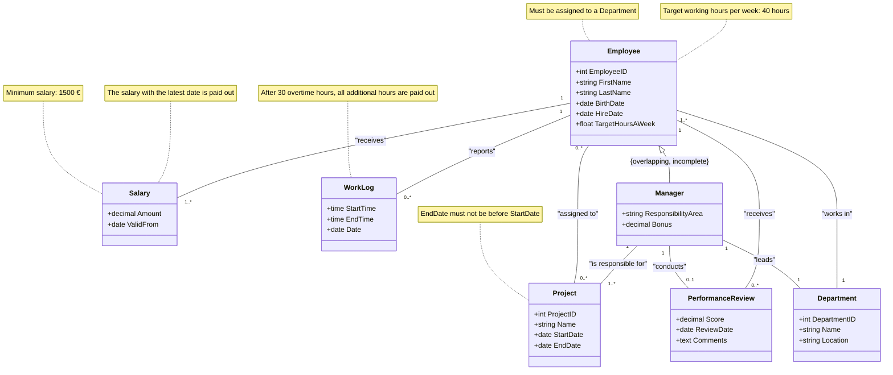

# Mitarbeiterverwaltung System (EMS)

## Overview

The Mitarbeiterverwaltung System (EMS) is designed to manage employee information for a company. It enables the storage and management of employment relationships, salaries, departments, and working hours. The system allows assigning employees to various projects and departments, tracking working hours, and monitoring salary changes over time. Additionally, it maintains a performance review system for evaluating employee performance.

### Key Features

- Manage employee information, including personal details and employment history.
- Assign employees to different projects and departments.
- Track working hours and manage overtime payments.
- Monitor salary changes over time.
- Conduct performance reviews for employees.

## Database Documentation

The Employee Management System (EMS) allows a company to manage its employees and store their information. This information includes employment relationships, salaries, departments, and working hours. The system provides the ability to assign employees to different projects and departments. Working hours must be recorded, and salary changes should be tracked over time. A performance class is intended to maintain the performance of each employee.

### Consistency Conditions

1. The end date of a project must not be before the start date of the project.
2. Every employee must be assigned to at least one department.
3. After 30 overtime hours, all additional hours are automatically paid out.
4. The target working hours per week are 40 hours.

### UML Class Diagram



## Prerequisites

- PostgreSQL installed and running.
- Access to the PostgreSQL command line (`psql`).
- Proper permissions to create databases and tables.

## Installation

1. **Clone the Repository:**

```sh
   git clone git@github.com:Traenqui/datenbanksysteme-1.git
   cd datenbanksysteme-1
```

2. Run the SQL script: To set up the database schema, insert data, and apply constraints, run the following command:

```sh
psql -U postgres -v ON_ERROR_STOP=on -f 0_runAllScripts.sql
```

This command will:

- Connect to the PostgreSQL instance.
- Create the nessessary tabes.
- Insert sample data into the tables
- Apply constraints to ensure data integrity

## Directory Structure

- `0_runAllScripts.sql`: A script that initializes the database environment, creates roles and the database, and runs all necessary setup scripts.
- `2_schema.sql`: Script to create the database schema.
- `3_inserts.sql`: Script to populate tables with sample data.
- `4_constraints.sql`: Script to add necessary constraints to ensure data consistency.

## Usage

After installation, you can interact with the EMS database using PostgreSQL commands or any PostgreSQL client (e.g., pgAdmin). Here are some example queries you can run:

1. View All Employees with Performace Scores:

```sql
SELECT
    e.EmployeeID,
    e.FirstName,
    e.LastName,
    d.Name AS Department,
    s.Amount AS Salary,
    pr.Score AS PerformanceScore,
    pr.Comments AS PerformanceComments
FROM
    Employee e
JOIN
    Department d ON e.DepartmentID = d.DepartmentID
JOIN
    Salary s ON e.EmployeeID = s.EmployeeID
LEFT JOIN
    PerformanceReview pr ON e.EmployeeID = pr.EmployeeID
WHERE
    pr.ReviewDate = (
        SELECT MAX(ReviewDate)
        FROM PerformanceReview
        WHERE EmployeeID = e.EmployeeID
    )
ORDER BY
    e.LastName, e.FirstName;
```

## Course Context

This project is part of the "Datenbanksysteme 1" course, which focuses on the principles and practices of database management systems.

## Contributing

Contributions are welcome! If you have suggestions for improvements or want to report a bug, please open an issue or submit a pull request.

## License

This project is licensed under the MIT License - see the [LICENSE](./LICENSE) file for details.

## Acknowledgments

Inspired by employee management systems.
PostgreSQL documentation for database management and query syntax.
