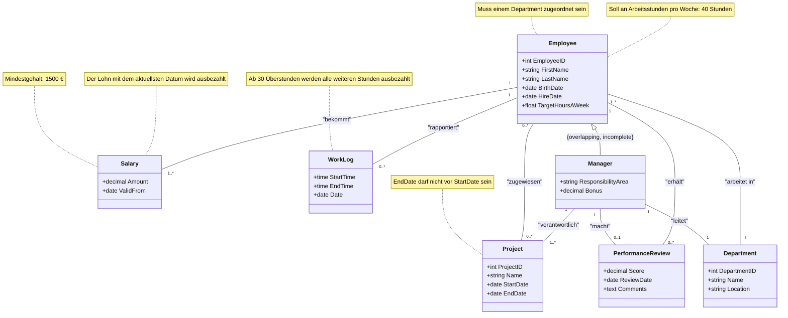

# Mitarbeiterverwaltung

## Testat 1

### Aufgabe 1: Themenwahl

Mitarbeiterverwaltungssystem (EMS)

### Aufgabe 2: Beschreibung und Konsistenzbedingungen

Das Mitarbeiterverwaltungssystem (EMS) ermöglicht es einem Unternehmen, ihre Mitarbeiter zu verwalten und ihre Informationen zu speichern.
Informationen beinhalten Beschäftigungsverhältnisse, Gehälter, Abteilungen und Arbeitszeiten.
Es soll die Möglichkeit bieten Mitarbeiter verschiedenen Projekten und Abteilungen zuzuweisen.
Die Arbeitszeiten müssen erfasst werden können und Gehaltsänderungen sollen über die Zeit verfolgt werden können.
Eine Performance-Klasse soll die Performance eines jeden Mitarbeiter festhalten

#### Konsistenzbedingungen

1. Das Enddatum eines Projektes darf nicht vor dem Startdatum des Projektes sein
2. Jeder Mitarbeiter muss mindesten einer Abteilung zugeordnet sein
3. Ab 30 Überstunden werden alle weiteren Stunden automatisch ausbezahlt
4. Das Soll an Arbeitsstunden pro Woche sind 40 Stunden

### Aufgabe 3: UML-Klassendiagramm erstellen

