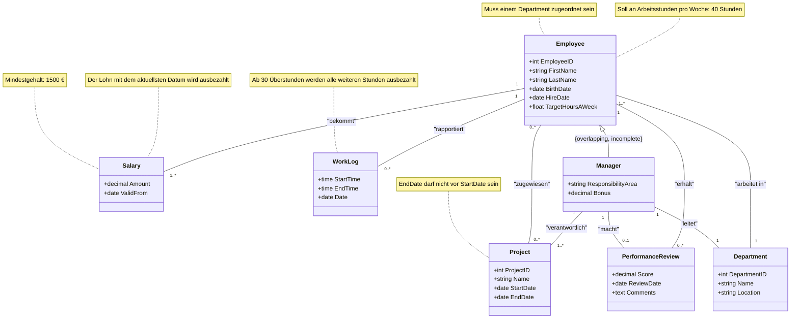

# Mitarbeiterverwaltung

## Testat 1

### Aufgabe 1: Themenwahl

Mitarbeiterverwaltungssystem (EMS)

### Aufgabe 2: Beschreibung und Konsistenzbedingungen

Das Mitarbeiterverwaltungssystem (EMS) ermöglicht es einem Unternehmen, ihre Mitarbeiter zu verwalten und ihre Informationen zu speichern.
Informationen beinhalten Beschäftigungsverhältnisse, Gehälter, Abteilungen und Arbeitszeiten.
Es soll die Möglichkeit bieten Mitarbeiter verschiedenen Projekten und Abteilungen zuzuweisen.
Die Arbeitszeiten müssen erfasst werden können und Gehaltsänderungen sollen über die Zeit verfolgt werden können.
Eine Performance-Klasse soll die Performance eines jeden Mitarbeiter festhalten

#### Konsistenzbedingungen

1. Das Enddatum eines Projektes darf nicht vor dem Startdatum des Projektes sein
2. Jeder Mitarbeiter muss mindesten einer Abteilung zugeordnet sein
3. Ab 30 Überstunden werden alle weiteren Stunden automatisch ausbezahlt
4. Das Soll an Arbeitsstunden pro Woche sind 40 Stunden

### Aufgabe 3: UML-Klassendiagramm erstellen



## Testat 2

### Aufgabe 1: Logischer Datenbank-Entwurf

##### Employee

Verknüpfung mit der `Department`-Tabelle durch **FOREIGN KEY** auf `DepartmentID`.

```sql
Employee (
  EmployeeID Serial,
  FirstName VARCHAR(255) NOT NULL,
  LastName VARCHAR(255) NOT NULL,
  BirthDate DATE NOT NULL,
  HireDate DATE NOT NULL,
  TargetHoursAWeek DECIMAL(5, 2),
  DepartmentID INT NOT NULL
)
```

##### Project

```sql
Project (
  ProjectID Serial,
  Name VARCHAR(255) NOT NULL,
  StartDate Date NOT NULL,
  EndDate Date NOT NULL
)
```

##### Salary

Verknüpfung mit der `Employee`-Tabelle durch **FOREIGN KEY** auf `EmployeeID`.

```sql
Salary (
  SalaryID Serial,
  EmployeeID NOT NULL REFERENCES Employee,
  Amount DECIMAL(10, 2),
  ValidFrom Date NOT NULL
)
```

##### Worklog

Verknüpfung mit der `Employee`-Tabelle durch **FOREIGN KEY** auf `EmployeeID`.

```sql
WorkLog (
    WorkLogID SERIAL,
    EmployeeID NOT NULL REFERENCES Employee,
    StartTime TIME NOT NULL,
    EndTime TIME NOT NULL,
    Date DATE NOT NULL
)
```

##### Performance Review

Verknüpfung mit der `Employee`-Tabelle durch **FOREIGN KEY** auf `EmployeeID`.

```sql
PerformanceReview (
    ReviewID SERIAL,
    EmployeeID NOT NULL REFERENCES Employee,
    Score DECIMAL(5, 2),
    ReviewDate DATE NOT NULL,
    Comments TEXT
)
```

##### Manager

Verknüpfung mit der `Employee`-Tabelle durch **FOREIGN KEY** auf `EmployeeID`.

```sql
Manager (
    ManagerID SERIAL,
    EmployeeID NOT NULL REFERENCES Employee,
    ResponsibilityArea VARCHAR(255) NOT NULL,
    Bonus DECIMAL(10, 2)
)
```

### Vererbungsabbildung

In diesem Fall wird die Vererbung zwischen Employee und Manager durch separate Tabellen dargestellt:

1. `Employee`-Tabelle speichert die allgemeinen Informationen aller Mitarbeiter, einschließlich Manager, wie Vorname, Nachname, Geburtsdatum, etc.
2. `Manager`-Tabelle speichert nur die zusätzlichen Attribute, die für Manager spezifisch sind, wie `ResponsibilityArea` und `Bonus`. Die Verbindung zur Tabelle Employee erfolgt über das Attribut `EmployeeID`, das in der Manager-Tabelle eindeutig ist.

#### Vererbungsstrategie: Table-per-Subclass

Die **Table-per-Subclass**-Strategie wurde verwendet, weil sie eine klare Trennung zwischen gemeinsamen und speziellen Daten ermöglicht. Manager haben zusätzliche Eigenschaften, die für normale Mitarbeiter nicht relevant sind. Durch die separate Speicherung dieser spezifischen Attribute in einer eigenen Tabelle (`Manager`) entsteht eine flexiblere und erweiterbare Struktur. Jede Zeile in der Manager-Tabelle entspricht also einem `Employee`, der Manager ist.

##### Vorteile

- Die Tabelle `Employee` bleibt _schlank_ und enthält nur die Attribute, die für alle Mitarbeiter relevant sind.
- `ResponsibilityArea` und `Bonus`, sind Manager-spezifische Attribute und müssen solmit nur für die Manager gespeichert werden. Dies unterstützt die Datenkonsistenz und Integrität.
- Die Tabellen bleiben leicht erweiterbar, falls in Zukunft weitere Subklassen von `Employee` hinzugefügt werden sollen.

##### Nachteile

- Es müssen `JOIN` Abfragen verwendet werden, wenn Manager- und Mitarbeiterdaten gleichzeitig abgefragt werden sollen.
- Die Komplexität der Abfragen steigt mit jeder weiteren Subklasse.

Wir haben diese Strategie gewählt, da nur wenige Mitarbeiter Manager sind. Zudem soll die Mitarbeiter-Tabelle nur die Klassenspezifischen Attribute enthalten, damit wir diese in Zukunft leichter erweitern können.

### Aufgabe 2: Datenbank erstellen

Diese Aufgabe wurde mit der Datei [0_runnAllScripts.sql](./0_runAllScripts.sql) gelöst.

### Aufgabe 3: Tabellen erstellen

Diese Aufgabe wurde mit der Datei [2_schema.sql](./2_schema.sql) gelöst.

### Aufgabe 4: Testdaten einfügen

Die Demodaten in dem Skript wurden durch ChatGPT erstellt. Diese Aufgabe wurde auch als separate [Datei](./3_inserts.sql) gelöst.

### Aufgabe 5: Konsistenzbedingungen umsetzen

Diese Aufgabe wurde mit der Datei [4_constraints.sql](./4_constraints.sql) gelöst.

### Beispiel Query

```sql
SELECT
    e.EmployeeID,
    e.FirstName,
    e.LastName,
    d.Name AS Department,
    s.Amount AS Salary,
    pr.Score AS PerformanceScore,
    pr.Comments AS PerformanceComments
FROM
    Employee e
JOIN
    Department d ON e.DepartmentID = d.DepartmentID
JOIN
    Salary s ON e.EmployeeID = s.EmployeeID
LEFT JOIN
    PerformanceReview pr ON e.EmployeeID = pr.EmployeeID
WHERE
    pr.ReviewDate = (
        SELECT MAX(ReviewDate)
        FROM PerformanceReview
        WHERE EmployeeID = e.EmployeeID
    )
ORDER BY
    e.LastName, e.FirstName;
```
